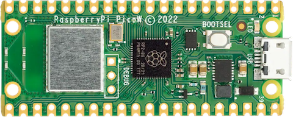

# Pico-W-demo-conectada-a-Wifi

## SPBB22-Pico W demo conectada a Wifi
### Se utilizo el software de Thonny
### Lenguaje de programación, MicroPhyton

### Esta es una presentación de la materia de Sistemas Programables

### En este apartado se necesito:

* Una Raspberry Pi Pico W
* Un Nombre de Wi-fi
* Una Contraseña de la misma Wi-fi a utlizar
* 3 archivos, los cuales son Secrets, el Main y un index con lenguaje HTML.

